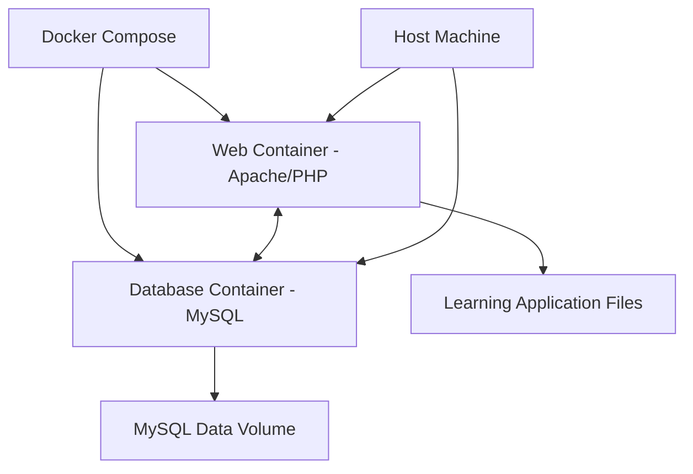

# Design Document

## Overview

The Virtual University dockerization design implements a multi-container architecture using Docker Compose to provide a complete LAMP stack environment. The solution consists of two main services: a web server container running Apache with PHP 7.4, and a database container running MySQL 5.7. The design ensures automatic database initialization, proper file mounting for development, and environment-based configuration management.

## Architecture

### Container Architecture



### Service Components

1. **Web Service (Apache/PHP)**
   - Base Image: `php:7.4-apache`
   - Exposed Port: 8080 (host) → 80 (container)
   - Document Root: `/var/www/html`
   - PHP Extensions: mysqli, pdo_mysql
   - Apache Modules: mod_rewrite enabled

2. **Database Service (MySQL)**
   - Base Image: `mysql:5.7`
   - Exposed Port: 3306 (internal only)
   - Database: `sw15_update`
   - Character Set: `utf8mb4`
   - Collation: `utf8mb4_unicode_ci`

## Components and Interfaces

### Docker Compose Configuration

The `docker-compose.yml` file defines the multi-container application with the following services:

- **web**: Apache/PHP container with volume mounts and environment variables
- **db**: MySQL container with initialization scripts and data persistence
- **volumes**: Named volume for MySQL data persistence
- **networks**: Internal network for service communication

### Dockerfile for Web Service

Custom Dockerfile extends `php:7.4-apache` to:
- Install required PHP extensions (mysqli, pdo_mysql)
- Enable Apache mod_rewrite
- Set proper permissions for CodeIgniter
- Configure Apache virtual host

### Database Initialization

MySQL container uses initialization scripts to:
- Create the `sw15_update` database
- Execute the schema from `Sql/Update_proyect.sql`
- Set up proper user permissions
- Configure character set and collation

### Environment Configuration

Environment variables manage:
- Database connection parameters
- CodeIgniter environment settings
- Apache configuration
- MySQL root password and user credentials

## Data Models

### Database Configuration Model

```php
// Environment-based database configuration
$db['default'] = array(
    'hostname' => getenv('DB_HOST') ?: 'db',
    'username' => getenv('DB_USER') ?: 'learning_user',
    'password' => getenv('DB_PASS') ?: 'learning_pass',
    'database' => getenv('DB_NAME') ?: 'sw15_update',
    'dbdriver' => 'mysqli',
    'char_set' => 'utf8mb4',
    'dbcollat' => 'utf8mb4_unicode_ci'
);
```

### Volume Mapping Model

- **Application Files**: `./Learning:/var/www/html` (bind mount for development)
- **Database Data**: `mysql_data:/var/lib/mysql` (named volume for persistence)
- **Database Init**: `./Sql:/docker-entrypoint-initdb.d` (initialization scripts)

## Error Handling

### Container Health Checks

1. **Web Container Health Check**
   - HTTP request to localhost:80
   - Retry interval: 30 seconds
   - Timeout: 10 seconds
   - Start period: 40 seconds

2. **Database Container Health Check**
   - MySQL connection test
   - Retry interval: 30 seconds
   - Timeout: 20 seconds
   - Start period: 80 seconds

### Error Recovery Strategies

1. **Database Connection Failures**
   - Implement retry logic in CodeIgniter database configuration
   - Use Docker Compose depends_on with condition: service_healthy
   - Provide clear error messages for connection issues

2. **File Permission Issues**
   - Set proper ownership in Dockerfile (www-data:www-data)
   - Configure umask for development environment
   - Document permission troubleshooting steps

3. **Port Conflicts**
   - Use configurable ports via environment variables
   - Provide alternative port configurations
   - Document port conflict resolution

## Testing Strategy

### Development Testing

1. **Local Development Setup**
   - Test file synchronization between host and container
   - Verify hot-reload functionality for PHP files
   - Test database persistence across container restarts

2. **Database Integration Testing**
   - Verify automatic schema initialization
   - Test default user creation and login
   - Validate database connection from application

### Production Readiness Testing

1. **Environment Variable Testing**
   - Test different database configurations
   - Verify security settings in production mode
   - Test with external database connections

2. **Performance Testing**
   - Load testing with multiple concurrent users
   - Database query performance validation
   - Container resource usage monitoring

### Security Testing

1. **Container Security**
   - Scan images for vulnerabilities
   - Test with non-root user execution
   - Validate network isolation between containers

2. **Application Security**
   - Test CodeIgniter security configurations
   - Validate database credential management
   - Test HTTPS configuration readiness

## Configuration Management

### Environment Files

1. **Development Environment (.env.development)**
   ```
   DB_HOST=db
   DB_USER=learning_user
   DB_PASS=learning_pass
   DB_NAME=sw15_update
   CI_ENV=development
   APACHE_PORT=8080
   ```

2. **Production Environment (.env.production)**
   ```
   DB_HOST=${PRODUCTION_DB_HOST}
   DB_USER=${PRODUCTION_DB_USER}
   DB_PASS=${PRODUCTION_DB_PASS}
   DB_NAME=${PRODUCTION_DB_NAME}
   CI_ENV=production
   APACHE_PORT=80
   ```

### CodeIgniter Configuration Updates

1. **Database Configuration**
   - Modify `application/config/database.php` to use environment variables
   - Implement fallback values for development

2. **Base URL Configuration**
   - Update `application/config/config.php` for Docker environment
   - Support dynamic base URL detection

3. **Session Configuration**
   - Configure session storage for containerized environment
   - Ensure session persistence across container restarts

## Deployment Strategy

### Development Deployment

1. **Quick Start Process**
   ```bash
   git clone [repository]
   cd virtual-university
   docker-compose up -d
   ```

2. **Development Workflow**
   - File changes reflected immediately
   - Database changes require container restart
   - Logs accessible via `docker-compose logs`

### Production Deployment

1. **Production Setup**
   - Use production environment file
   - Configure external database if needed
   - Set up proper backup strategies
   - Implement monitoring and logging

2. **Scaling Considerations**
   - Separate database to external service
   - Use load balancer for multiple web containers
   - Implement shared session storage (Redis/Memcached)